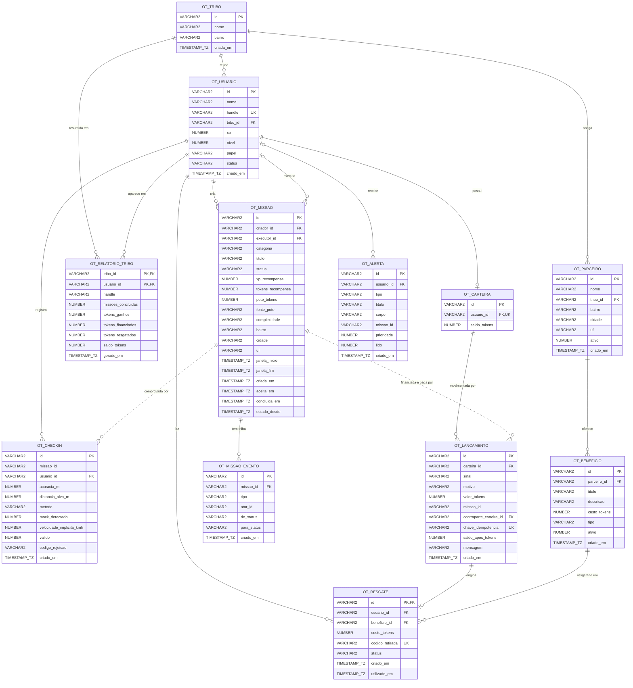

# DER — modelo relacional Oracle

Modelo físico implantado por [`sql/01_tabelas.sql`](../sql/01_tabelas.sql): 12 tabelas, todas com o
prefixo `OT_`. O significado de cada coluna e a origem de cada tabela no PostgreSQL do projeto estão
no [dicionário de dados](DICIONARIO.md).

## Diagrama

## Como ler

**Linha contínua** é chave estrangeira declarada no banco. **Linha pontilhada** é referência por id
sem `FOREIGN KEY`, e são três, todas deliberadas:

| Referência | Por que não tem FK |
|---|---|
| `OT_LANCAMENTO.MISSAO_ID` → missão | A carteira referencia a missão por id puro para não depender do módulo de missões. É a mesma decisão do sistema de origem, onde `carteira` e `missoes` são módulos separados. |
| `OT_CHECKIN.MISSAO_ID` → missão | Mesmo motivo: a geolocalização registra a leitura sem depender da missão. |
| `OT_ALERTA.MISSAO_ID` → missão | O alerta sobrevive à missão a que se refere. |

`OT_MISSAO_EVENTO.ATOR_ID` também não tem FK: fica **nulo** quando quem agiu foi o sistema (a
varredura por prazo), e não uma pessoa.

## Cardinalidades que carregam regra de negócio

- **Usuário 1 — 0..1 Carteira.** A conta de sistema existe sem carteira. É o caso que
  `PRC_OT_RESGATAR_BENEFICIO` trata com o erro `-20032`.
- **Lançamento 1 — 0..1 Resgate, com o mesmo id.** `OT_RESGATE.ID` é chave primária e chave
  estrangeira para `OT_LANCAMENTO.ID`. O resgate e o débito nascem na mesma transação, e o modelo
  torna impossível existir resgate sem o lançamento que o pagou.
- **Usuário 0..1 — N Missão (executor).** Missão aberta ainda não tem executor.
- **Tribo 1 — N Usuário, opcional do lado do usuário.** O apoiador do bairro e a conta de sistema
  não pertencem a tribo nenhuma.

## O que não está no diagrama, de propósito

| Ficou no PostgreSQL | Motivo |
|---|---|
| Coordenadas (`GEOGRAPHY`) de missão, check-in e parceiro | O geoespacial é do PostGIS. Aqui ficam bairro, cidade e a distância já calculada. |
| E-mail e hash de senha do usuário | Esta camada é analítica; credencial não tem uso nela. |
| Saldo e lançamentos em reais | BRL está fora do ciclo de missões (ADR 0009). |
| Consentimento, refresh token, dispositivo, auditoria, outbox | Infraestrutura de sessão e de mensageria, sem papel nas rotinas PL/SQL. |
