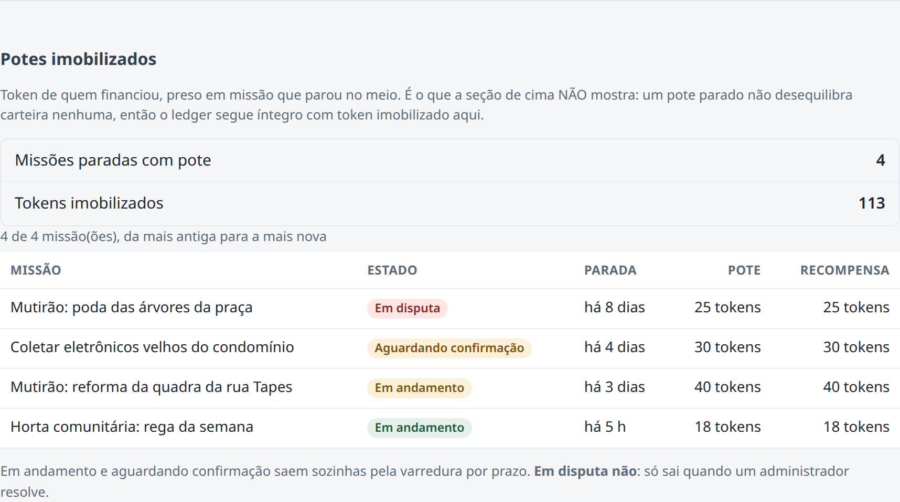

# PBL Fase 6 — Smart HAS · Omni-Tribo

**FIAP — Sistemas de Informação**
**RM 555833 — Renan Ferreira**

**Repositório:** https://github.com/RenanFerreira02/Omni-Tribo-PBL
**Vídeo (YouTube, não listado):** `COLE-A-URL-DO-VIDEO-AQUI`
**Pasta desta entrega:** [`Oracle/`](../README.md)

---

## 1. O que foi entregue

O Omni-Tribo é um app de missões sociais de bairro: vizinho ajuda vizinho, faz check-in
geolocalizado e recebe XP e um token comunitário, resgatável em benefícios de comércios locais. Até
a Fase 5 o sistema era app mobile, API Spring Boot sobre PostgreSQL + PostGIS e um dashboard Angular.

Nesta fase o projeto ganhou uma **camada Oracle com PL/SQL**, ligada ao Java:

| | |
|---|---|
| Tabelas | 12, com chaves, `CHECK`, índices e 3 triggers |
| Dados | 87 linhas exportadas do sistema + 6 cenários simulados |
| Functions | 5 (2 de indicador, 2 de formatação, 1 de apoio) |
| Procedures | 3 |
| Integração | REST → Java → JDBC → Oracle, em 3 endpoints |
| Testes | 90 asserções em PL/SQL + 7 testes unitários no Java |
| Banco | Oracle Database 19c, instância da FIAP |

Tudo foi **executado**, e a saída está em [`evidencias/`](../evidencias/README.md).

### Como o domínio do projeto responde aos exemplos do enunciado

O enunciado fala em sensores, alertas e consumo. No Omni-Tribo:

| No enunciado | No projeto |
|---|---|
| Leitura de sensor | Check-in: a leitura de GPS do aparelho de quem executa a missão |
| Leitura crítica | Check-in rejeitado (fora do raio, acurácia insuficiente, localização simulada) e missão parada além do prazo |
| Alerta | Aviso gravado ao financiador que recebeu estorno, ao executor pago e à operação quando algo falha |
| Consumo por usuário | Tokens ganhos, financiados e resgatados por membro da tribo |

---

## 2. Parte 1 — Aprimoramento da solução

### Funcionalidade nova: diagnóstico de potes imobilizados

`GET /api/v1/admin/missoes/potes-imobilizados`, restrito a administrador, em `services/api`.

**O problema que ela resolve.** Missões comunitárias têm um pote de tokens financiado por vizinhos.
Se a missão para no meio — o executor some, o criador não confirma, ou há uma disputa —, esse token
fica preso. O sistema já tinha como *tirar* a missão desse estado (varredura por prazo e uma ação
manual de destravar), mas **nada mostrava quais missões estavam presas**. E a verificação de
integridade existente continuava respondendo "íntegro", porque ela compara carteira com extrato e
um pote parado não desequilibra nenhuma carteira.

Essa lacuna estava registrada como pendência conhecida do projeto desde agosto. O endpoint lista as
missões paradas com token no pote, da mais antiga para a mais nova, e soma o total imobilizado.

**É o mesmo diagnóstico da camada Oracle**, agora no sistema real: a consulta 3 de
[`06_consultas_de_uso.sql`](../sql/06_consultas_de_uso.sql) e o endpoint respondem à mesma pergunta.

A funcionalidade atravessa as três camadas: consulta no banco, endpoint na API e uma seção nova na
tela `/admin` do dashboard Angular.



Medido com o sistema em execução: **113 tokens imobilizados em 4 missões**, enquanto a verificação
de integridade respondia `integro: true` sobre a mesma base. É a lacuna que o endpoint fecha.

| Arquivo | Papel |
|---|---|
| `apps/dashboard/…/pages/admin` | Seção "Potes imobilizados", com selo de urgência por estado |
| `missoes/api/PotesImobilizadosAdminController` | Borda REST, só ADMIN, paginada com teto de 100 |
| `missoes/dominio/PotesImobilizadosService` | Define o que conta como "parada" |
| `missoes/infra/MissaoRepository` | As duas consultas |
| `PotesImobilizadosAdminTest` | 6 testes de integração com PostgreSQL real |

### Boas práticas aplicadas nesta fase

- **Monólito modular preservado.** O endpoint novo vive no módulo `missoes` e não no de `carteira`,
  porque lê dados de missão. A regra de fronteira entre módulos é verificada por teste automatizado
  de arquitetura (ArchUnit), e o build reprovaria a dependência errada.
- **Erro mapeado por código, não por texto.** No Java que fala com o Oracle, cada código levantado
  pelo PL/SQL vira um status HTTP específico. Erro desconhecido responde 500 genérico: mensagem de
  driver, nome de schema e pilha de chamadas não chegam ao cliente.
- **Transação de quem chama.** Nenhuma procedure faz `COMMIT`. Quem confirma ou desfaz é o Java.
- **Idempotência.** Repetir um resgate com a mesma chave devolve o resgate anterior e não debita de
  novo.
- **Medir antes de afirmar.** A primeira versão da tradução de erro passava no teste unitário e
  respondia 500 contra o banco real. O defeito foi achado pela execução, corrigido e coberto por
  teste de regressão. O relato está em [`evidencias/README.md`](../evidencias/README.md).

### Valor agregado

O administrador passa a enxergar token preso sem depender de reclamação. E o projeto ganha uma
segunda implementação, no banco, de três regras centrais — o que permite conferir uma contra a outra.

---

## 3. Parte 2 — Integração do banco Oracle

### A decisão de arquitetura

O Oracle entra **ao lado** do PostgreSQL, não no lugar dele. O enunciado pede para "estender a
arquitetura com uma camada de persistência Oracle", e é o que foi feito.

Trocar o banco inteiro foi descartado: o sistema depende do PostGIS para o radar de missões e para a
validação do check-in, e tem 28 migrations e 580 testes de back-end sobre ele. O Oracle recebe uma
projeção das entidades principais, e é sobre ela que o PL/SQL roda.

```
   App mobile ─┐
               ├──► API Spring Boot ──► PostgreSQL + PostGIS     (sistema transacional)
   Dashboard ──┘                              │
                                              │ exportação do seed
                                              ▼
   Cliente REST ──► Java (Oracle/java) ──► Oracle 19c            (camada PL/SQL)
                        JDBC / CallableStatement
```

### Modelo lógico e físico

12 tabelas, todas com prefixo `OT_`: tribo, usuário, carteira, lançamento, missão, evento de missão,
check-in, parceiro, benefício, resgate, alerta e relatório de tribo.

- **DER:** [`DER.md`](DER.md), com o diagrama renderizado em [`DER.svg`](DER.svg)
- **Dicionário de dados:** [`DICIONARIO.md`](DICIONARIO.md), tabela por tabela, coluna por coluna
- **DDL:** [`sql/01_tabelas.sql`](../sql/01_tabelas.sql)

O que o modelo preserva do sistema de origem:

| Regra | Como aparece no Oracle |
|---|---|
| Token é inteiro | `NUMBER(19)`, nunca decimal |
| Saldo não fica negativo | `CHECK (saldo_tokens >= 0)` |
| Extrato é append-only | Trigger que rejeita `UPDATE` e `DELETE` |
| Resgate não existe sem o débito | `OT_RESGATE.ID` é chave primária e estrangeira para `OT_LANCAMENTO` |
| Benefício nunca tem preço em reais | `CHECK` com `REGEXP_LIKE` |
| Operação repetida não duplica | `UNIQUE` na chave de idempotência |

### Implantação

Instância da FIAP, usuário `rm555833`, Oracle Database 19c. A instalação cria os 23 objetos sem erro
de compilação — saída em [`evidencias/01-instalacao.txt`](../evidencias/01-instalacao.txt).

O schema do aluno é compartilhado com outras disciplinas. Por isso todo objeto tem o prefixo `OT_`,
e o script de desinstalação apaga só o que tem esse prefixo.

### Dados importados

| Origem | Conteúdo |
|---|---|
| **Sistema** — exportado do PostgreSQL por [`dados/exportar_do_postgres.sh`](../dados/exportar_do_postgres.sh) | 4 tribos, 14 usuários, 13 carteiras, 18 lançamentos, 20 missões, 4 parceiros, 7 benefícios, 7 alertas |
| **Simulado** — [`sql/03_carga_cenarios.sql`](../sql/03_carga_cenarios.sql) | 6 missões paradas, 5 check-ins, 5 financiamentos, 2 resgates |

Os dados do sistema são os mesmos que o app usa em desenvolvimento, com os mesmos identificadores.
Os simulados existem porque o seed não tem missão parada, e as rotinas precisam de algo para tratar.

**Governança de dados.** E-mail, hash de senha e coordenada de check-in **não** foram exportados. A
camada é analítica e o servidor é institucional; o que não serve à análise não foi copiado.

---

## 4. Parte 3 — Functions e procedures em PL/SQL

Explicação completa de cada rotina em [`PLSQL.md`](PLSQL.md). Resumo:

### Functions

| Function | Papel | O que faz |
|---|---|---|
| `FN_OT_TAXA_CONCLUSAO_TRIBO` | **Indicador** | Percentual de missões da tribo que terminaram concluídas |
| `FN_OT_DIVERGENCIA_CARTEIRA` | **Indicador** | Diferença entre o saldo da carteira e a soma do extrato; zero = íntegra |
| `FN_OT_RESUMO_MISSAO` | **Dados formatados** | Uma linha legível com estado, título, recompensa, local e tempo parado |
| `FN_OT_FORMATAR_TOKENS` | Dados formatados | `1.234 tokens` |
| `FN_OT_NOVO_ID` | Apoio | Gera identificador |

Todas usam parâmetro `IN` e `RETURN`, têm cabeçalho comentado e tratam exceção (`NO_DATA_FOUND`,
`ZERO_DIVIDE`, `RAISE_APPLICATION_ERROR`).

**Uso em consultas SQL**, de [`evidencias/02-consultas-de-uso.txt`](../evidencias/02-consultas-de-uso.txt):

```
TRIBO                     MEMBROS TAXA_CONCLUSAO
---------------------- ---------- ----------------
Tribo Pinheiros                 4 100,00 %
Tribo Cidade Líder              3 sem dado
Tribo Jardim América            2 sem dado
Tribo Vila Madalena             2 sem dado
```

```
[Aguardando confirmação] Coletar eletrônicos velhos do condomínio · Coleta · 90 XP + 30 tokens · Cidade Líder/SP · há 4 dias · pote: 30 tokens
[Em andamento] Mutirão: reforma da quadra da rua Tapes · Tribo · 120 XP + 40 tokens · Cidade Líder/SP · há 3 dias · pote: 40 tokens
```

### Procedures

| Procedure | O que faz | Recursos |
|---|---|---|
| `PRC_OT_VARRER_MISSOES_PARADAS` | Rotina automatizada. Encerra missão vencida: devolve o pote a quem financiou, ou paga o executor que já comprovou presença. Registra alertas | 2 `CURSOR` (um parametrizado), `FOR UPDATE`, `LOOP`, `IF`, `SAVEPOINT`, exceções nomeadas |
| `PRC_OT_RESGATAR_BENEFICIO` | Troca token por benefício. **Acionada pelo Java** | `SELECT … FOR UPDATE`, `LOOP` com `EXIT WHEN`, `IF`, blocos com `EXCEPTION` |
| `PRC_OT_RELATORIO_TRIBO` | Relatório resumido de tokens por membro | `CURSOR` explícito (`OPEN`/`FETCH`/`CLOSE`), `LOOP`, `%ROWTYPE` |

**A varredura em execução:**

```
FALHA  f6000000-0000-0000-0000-000000000006  ORA-20021: Estorno devolveria 0 tokens, mas o pote tem 10.
Varredura concluída: 2 expirada(s), 2 concluída(s) por prazo, 60 tokens estornados, 1 falha(s).
```

A falha é proposital: um dos cenários é uma missão corrompida. A procedure a desfaz isoladamente,
grava um alerta e segue com as outras quatro.

**O relatório:**

```
Relatório de tokens — Tribo Cidade Líder
membro         nível  missões   ganhou  financiou  resgatou   saldo
-------------------------------------------------------------------
@jonas             2        1       37         72        15      50
@marlene           2        1       30         38        15      57
@renan             3        1       22         94        25     103
-------------------------------------------------------------------
3 membro(s) · 89 tokens ganhos em recompensa de missão.
```

### Procedure acionada pelo back-end Java

Aplicação Spring Boot em [`java/`](../java/). O evento de back-end é um `POST /oracle/resgates`:

```
POST /oracle/resgates ─► OracleController ─► RotinasService (@Transactional)
                                                   └─► RotinasOracle (CallableStatement)
                                                           └─► { call prc_ot_resgatar_beneficio(…) }
```

De [`evidencias/04-java-rest-jdbc-oracle.txt`](../evidencias/04-java-rest-jdbc-oracle.txt):

| Chamada | Resposta |
|---|---|
| Resgate com saldo | `201` — `{"resgateId":"5cf14fff-…","codigoRetirada":"B3XMFQTL","saldoTokens":27,"replay":false}` |
| A mesma chamada, mesma chave | `200` — mesmo resgate, `"replay":true`, saldo inalterado |
| Usuário sem saldo | `422` — "Saldo de 0 tokens é insuficiente para resgatar este benefício, que custa 15." |
| Benefício inativo | `404` — "Benefício indisponível." |
| Sem a chave de idempotência | `400` |

Depois das chamadas, a conferência direto no Oracle mostra **um único** lançamento para as duas
chamadas repetidas, nenhum para as recusadas, e todas as carteiras íntegras.

A varredura e os indicadores também têm endpoint (`POST /oracle/varredura`, `GET /oracle/indicadores`).

### Testes

[`sql/07_testes.sql`](../sql/07_testes.sql): **90 de 90** asserções, cobrindo caminho feliz e de
erro de cada rotina. Saída em [`evidencias/03-testes.txt`](../evidencias/03-testes.txt). O script
termina em `ROLLBACK` e pode ser repetido.

---

## 5. Como reproduzir

Passo a passo em [`Oracle/README.md`](../README.md#como-executar). Em resumo:

```bash
cp Oracle/.env.example Oracle/.env            # preencher usuário e senha
bash Oracle/executar.sh instalar.sql          # cria tudo
bash Oracle/executar.sh 06_consultas_de_uso.sql
bash Oracle/executar.sh 07_testes.sql
```

Sem SQLcl, os scripts de `Oracle/sql/` rodam no SQL Developer na ordem `00` a `07`.

---

## 6. Limites declarados

- **As procedures repetem regras que já existem em Java** e rodam sobre uma cópia dos dados. O
  sistema em produção continua usando o PostgreSQL e os serviços Java.
- **A aplicação Java desta fase é separada do back-end principal** e não tem autenticação: o
  usuário vem no corpo da requisição. No sistema real a identidade vem sempre do token.
- **Não há sincronização contínua** entre o PostgreSQL e o Oracle. A carga é feita uma vez.
- **Concorrência não foi medida no Oracle.** As procedures usam trava de linha e ordem
  determinística, mas não há teste multi-thread contra ele.
- **O geoespacial não foi levado.** Consultas por distância continuam no PostGIS.
