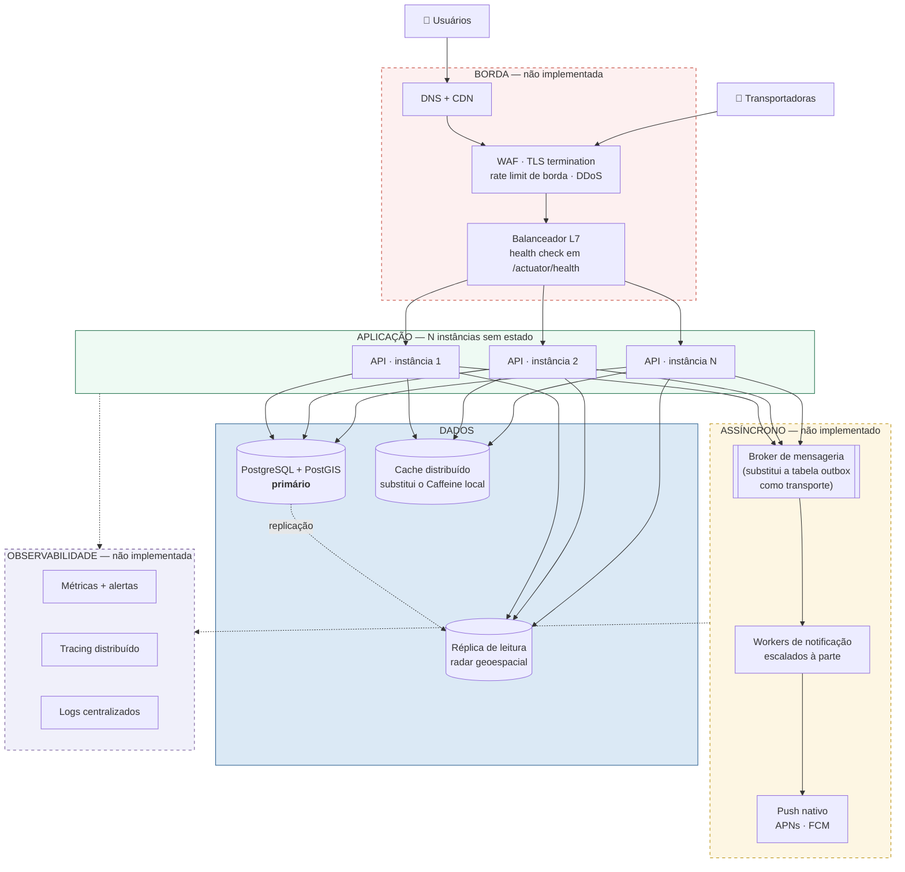
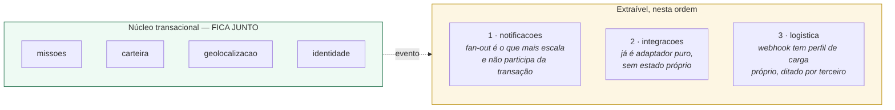

# Arquitetura-alvo em escala

> # ⚠️ VISÃO DE PRODUÇÃO — NÃO IMPLEMENTADA NESTE CICLO
>
> **Nada nesta página existe no repositório.** O que foi construído está em
> [`c4-contexto-e-conteineres.md`](c4-contexto-e-conteineres.md): uma API, um banco, um app, tudo
> numa máquina de desenvolvimento.
>
> Esta página existe para responder "e se precisasse escalar?" sem que a resposta contamine a
> descrição do que é real. Os dois desenhos ficam em arquivos separados exatamente por isso.

---

## Decomposição: o que sairia primeiro, e por quê

O monólito **não** se quebra em oito serviços porque tem oito módulos. A ordem abaixo segue carga e
independência de dado, não o organograma do pacote:

**`missoes` + `carteira` não se separam sem custo alto.** Concluir uma missão credita a carteira,
paga o pote, concede XP e anuncia — hoje tudo numa transação. Separados, isso vira saga com
compensação, e a invariante de conservação (já a mais frágil do sistema, ver
[fluxo econômico](fluxo-economico.md)) passaria a depender de compensação correta sob falha
parcial. **Seria trocar uma garantia por um problema.**

**`notificacoes` sai primeiro** porque já está desacoplado por construção: a conclusão publica um
evento e não espera resposta. Trocar a tabela `outbox` por um broker é substituir o *transporte* —
o padrão outbox continua sendo a forma de tornar "mudar estado" e "anunciar" atômicos.

## O que cada camada resolveria, e o que ela custa

| Camada | Resolve | Custo |
|---|---|---|
| **TLS/WAF** | tráfego em claro, ataque de aplicação, DDoS volumétrico | ponto único; TLS termination exige que a app deixe de confiar em cabeçalho de cliente — já preparado via `RemoteIpValve` |
| **Balanceador + N instâncias** | disponibilidade e capacidade | força **sessão sem estado** (já é: JWT) e obriga o cache local Caffeine a virar distribuído, senão cada instância decide diferente |
| **Réplica de leitura** | radar geoespacial é leitura pesada | atraso de replicação: missão criada e ainda não visível no radar |
| **Broker** | fan-out e picos | operação a mais; entrega *at-least-once* continua exigindo idempotência no consumidor — que já existe |
| **Observabilidade** | hoje não se sabe o que está lento em produção | custo de armazenamento e disciplina de instrumentação |

## Por que nada disso está no repositório

**Escopo declarado: desenvolvimento 100% local.** Broker, Redis, proxy reverso, Prometheus e Grafana
foram deliberadamente cortados do MVP. Um item de infraestrutura que ninguém opera não é arquitetura
demonstrada — é `docker-compose` mais comprido.

O que **foi** feito para que essa evolução seja possível depois:

- **Sessão sem estado** (JWT RS256), então N instâncias não exigem sessão pegajosa;
- **Fronteira de módulo verificada por ArchUnit** e **seis referências sem FK** no schema, para que
  extrair um módulo seja recorte e não reescrita;
- **Outbox transacional**, que troca de transporte sem mudar a semântica;
- **Idempotência em toda operação de valor**, que é o pré-requisito de qualquer entrega
  *at-least-once*;
- **`RemoteIpValve` com `trusted-proxies` configurável**, ausente em dev — a aplicação já sabe que,
  atrás de proxy, o IP do cliente vem por um caminho confiável e nunca do cabeçalho cru
  ([ADR 0019](../adr/0019-borda-http-cabecalho-nao-confiavel.md)).

## Premissas do documento estratégico que este desenho não sustenta

O PETI da entrega acadêmica projeta **50.000 conexões WebSocket simultâneas**. Não há WebSocket
algum no sistema — a comunicação é REST com *polling* pelo TanStack Query, e a notificação é
persistida em `alerta` e lida por consulta. Sustentar aquele número exigiria, antes deste desenho,
uma decisão de transporte que nunca foi tomada. Ver
[`../DIVERGENCIAS-DOCUMENTACAO.md`](../DIVERGENCIAS-DOCUMENTACAO.md).
