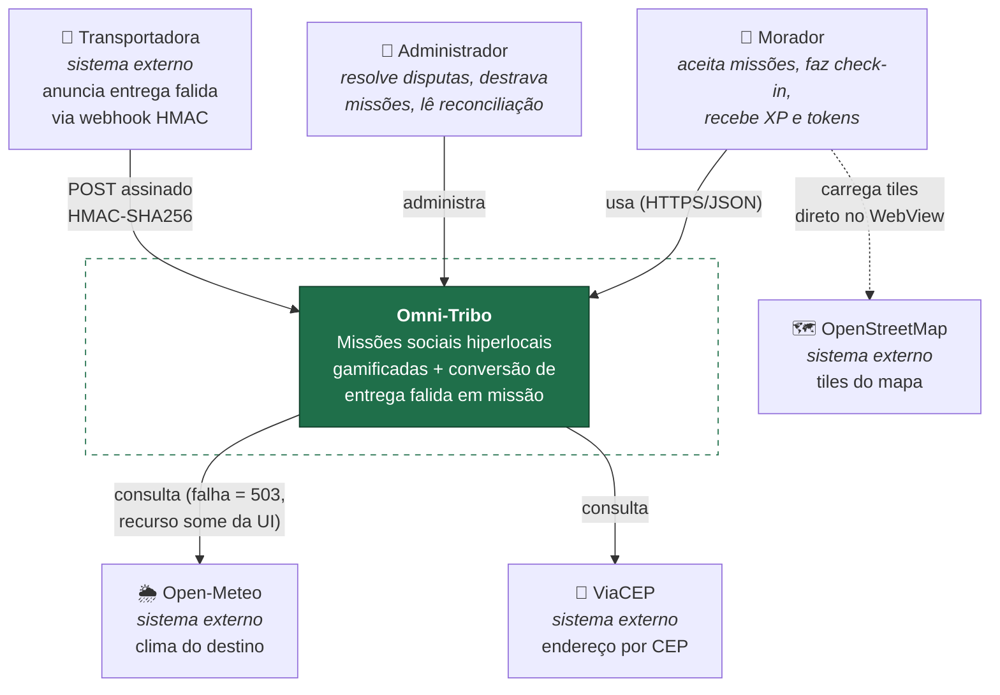
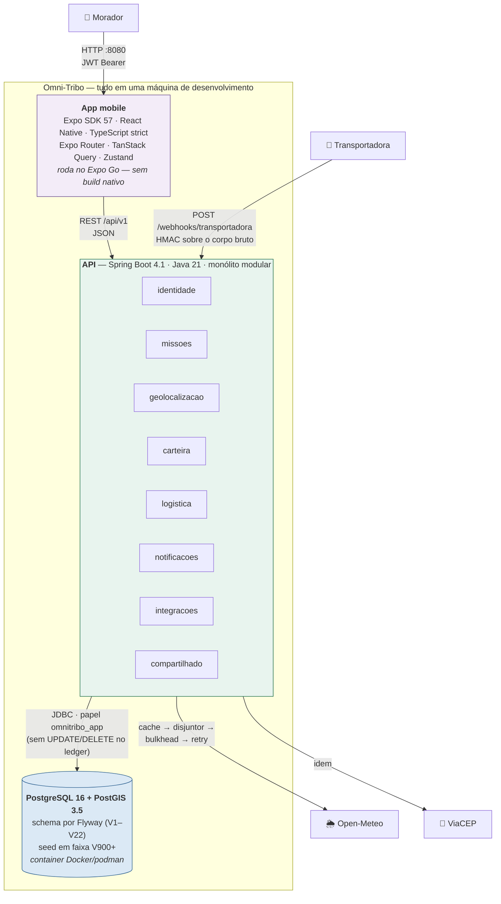

# C4 — contexto e contêineres

**Isto é o que FOI construído**, não o que se pretende construir. A visão de produção em escala está
em [`arquitetura-alvo.md`](arquitetura-alvo.md), separada de propósito para que as duas nunca sejam
confundidas numa banca.

Desenhado com `flowchart` em vez do `C4Context` do Mermaid: o modo C4 ainda é experimental e falha
de renderização em documento de entrega é risco desnecessário.

---

## Nível 1 — Contexto

**Por que os tiles do OpenStreetMap saem do aparelho e não da API:** o mapa é um WebView com Leaflet
([ADR 0012](../adr/0012-mapa-por-webview-e-leaflet.md)). Proxiar tile pela nossa API não traria
benefício e criaria um caminho de banda que nada exige.

**Clima e CEP, ao contrário, são proxiados** — o app nunca fala com Open-Meteo ou ViaCEP direto
([ADR 0011](../adr/0011-dependencias-externas-e-anonimizacao.md)). É o que permite cache, disjuntor
e resposta 503 uniforme quando o provedor cai.

---

## Nível 2 — Contêineres

### Portas de rede

| Porta | O quê | Observação |
|---|---|---|
| `8080` | API | Swagger UI em `/swagger-ui.html` no perfil `dev` |
| `8090` | Actuator | Cadeia de segurança **própria**: `health` e `info` anônimos, `metrics` autenticado |
| `5432` | PostgreSQL | container |
| `8081` | Metro/Expo | **é por isso que o actuator não está em 8081** — os dois juntos davam `BindException` e derrubavam a aplicação inteira |

### Os oito módulos

Um pacote por módulo, cada um com `api/` (controllers, DTOs, portas), `dominio/` (entidades, regras)
e `infra/` (repositórios, clientes). **Módulo só acessa outro por `api/` pública ou por evento** —
nunca repositório nem entidade JPA alheia. A regra é verificada por ArchUnit
(`RegrasArquiteturaTest`) sobre os 7 módulos de negócio; `compartilhado` é shared por design e tem
regra própria, mais restritiva, para `compartilhado/infra`
([ADR 0018](../adr/0018-fronteira-do-compartilhado.md)).

Essa fronteira é o que torna a decomposição da [arquitetura-alvo](arquitetura-alvo.md) um trabalho de
extração, e não de reescrita — e é a mesma razão pela qual seis referências entre módulos são **UUID
puro sem FK** no banco (ver [`er-banco.md`](er-banco.md)).
