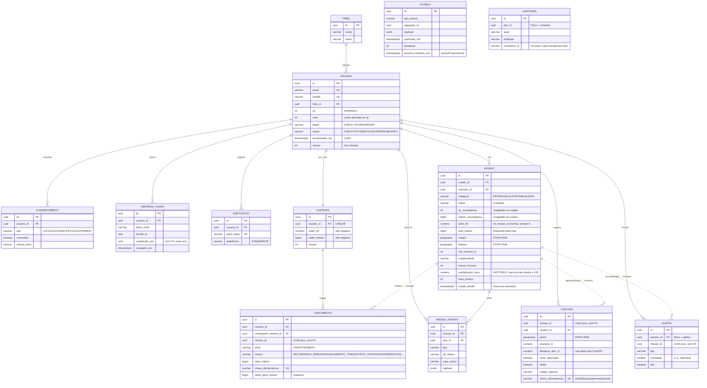

# ER do banco

Tabelas de negócio, schema aplicado por Flyway (`V1`–`V28`), seed em faixa separada `V900+`.

> **Atualizado em 2026-08-30 (ADR 0031).** Saíram deste diagrama `PONTO_CUSTODIA` e `ENTREGA_FALIDA`,
> dropadas pela `V28`, mais as colunas `missao.ponto_custodia_id` e `missao.faixa_risco`.
> `missao.multiplicador_risco` **continua no banco**, sem entidade que a mapeie: é o que explica a
> recompensa das missões de retirada já creditadas.

**Linha cheia = foreign key real. Linha pontilhada = referência por UUID puro, deliberadamente
SEM foreign key** — é a fronteira de módulo materializada no schema.

> `AUDITORIA` e `OUTBOX` aparecem sem aresta de propósito: a primeira registra ação sobre qualquer
> entidade e não tem FK para nenhuma; a segunda guarda `agregado_id` genérico.

## As quatro referências sem FK

| Coluna | Fronteira | Por quê |
|---|---|---|
| `checkin.missao_id` | `geolocalizacao` → `missoes` | |
| `lancamento.missao_id` | `carteira` → `missoes` | |
| `alerta.missao_id` | `compartilhado` → `missoes` | |
| `refresh_token.substituido_por` | auto-referência em `identidade` | evita constraint circular na rotação |

Eram seis: `missao.ponto_custodia_id` e `entrega_falida.missao_id` saíram com a `V28`.

As três primeiras existem pela mesma razão, documentada nas próprias migrations: **viabilizar a
extração futura de cada módulo em serviço independente sem quebrar o schema de quem referencia.** É
a fronteira do ArchUnit descendo até o banco — de nada adiantaria proibir o import em Java e manter
uma FK que impede separar as tabelas.

O preço é explícito: **não há integridade referencial nessas colunas**. Quem apaga precisa saber o
que está apagando, e é por isso que as tabelas relevantes são append-only.

## Três tabelas append-only

`lancamento`, `auditoria` e `checkin` são **append-only**, com `REVOKE UPDATE, DELETE` para o papel
da aplicação. Correção se faz por **estorno**, nunca por `UPDATE`.

O `REVOKE` já esteve **inerte**: a aplicação conectava como dono das tabelas, e dono ignora `REVOKE`.
Hoje ela conecta como `omnitribo_app`, o Flyway tem credencial própria com DDL
([ADR 0017](../adr/0017-papeis-de-banco-separados.md)), e
`MigracaoTest.aplicacao_nao_consegue_apagar_nem_alterar_o_ledger_em_runtime` prova em runtime
(SQLState 42501) — não mais lendo o catálogo.

## Convenções de tipo

| Dado | Tipo | Nunca |
|---|---|---|
| Dinheiro | `numeric(12,2)` → `BigDecimal` | `double`, `String` |
| Tokens | `bigint` | |
| Coordenada | `geography(POINT,4326)` | par de `double`; distância **nunca** é armazenada |
| Data/hora | `timestamptz` | `timestamp` |
| Enum | `varchar` + `CHECK` + `EnumType.STRING` | ordinal |
