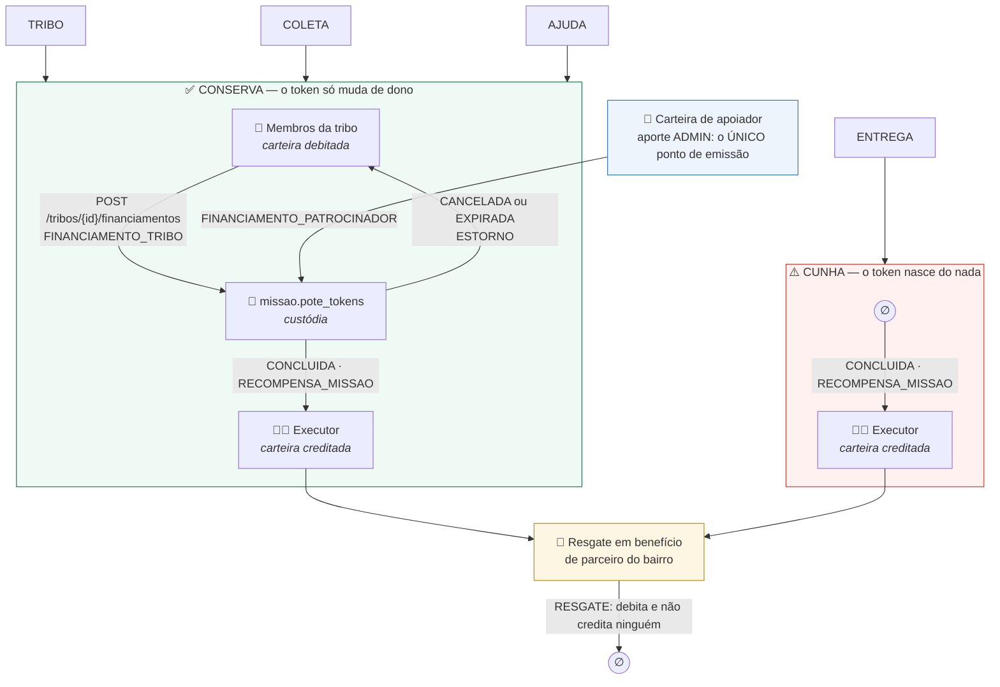
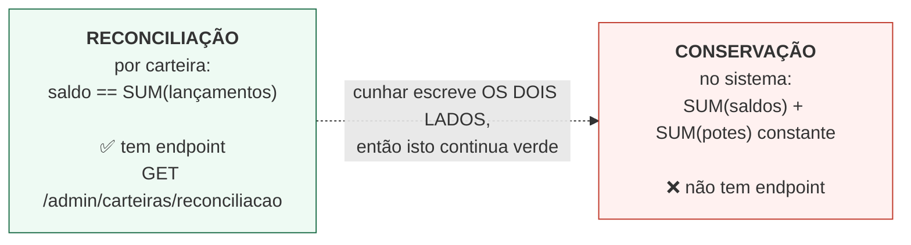

# Fluxo econômico — quem financia, onde o token nasce, onde ele morre

Três moedas, e só uma circula no ciclo de missões.
Ver [ADR 0009](../adr/0009-economia-do-cuidado-token-como-recompensa.md).

| Moeda | Papel | Circula? |
|---|---|---|
| **XP** | reputação — deriva o nível, filtra elegibilidade | não é transferível, não tem ledger, só cresce |
| **TOKEN** | moeda comunitária — recompensa de **todas** as categorias | sim, transferível dentro da tribo |
| **BRL** | **fora do ciclo de missões** | `ck_missao_economia` exige `valor_brl = 0` em toda missão |

**A premissa que governa tudo: quem cria a missão NÃO paga.** A recompensa é calculada pelo servidor
e congelada na criação — o DTO de criação não tem `xpRecompensa` nem `tokensRecompensa`.

---

## Por onde o TOKEN entra e sai

## O que o diagrama admite

**As duas arestas que faltavam foram fechadas**, e a história de cada uma está aqui porque é ela que
explica por que o desenho é este.

**1. O patrocinador não existia — e passou a existir.** Até 2026-08-20, ENTREGA e AJUDA cunhavam.
Medido do zero em 2026-08-16: um ciclo AJUDA aumentou `SUM(saldos) + SUM(potes)` em exatamente o
valor da recompensa, enquanto um ciclo TRIBO financiado deixou a soma parada
([evidência de época](../evidencias/f13-conservacao-por-categoria.md)).

Aquilo **não tinha sido contornado por esquecimento**. Exigir pote para ENTREGA faria membros da
tribo custearem a logística do varejista — o inverso do modelo. O financiador correto é o
patrocinador: entrega que falhou custa re-entrega, armazenagem e risco de perder o cliente, então
patrocinar o pote sai mais barato que o fracasso. É esse o caso de negócio, e preferiu-se **uma
lacuna documentada a uma regra errada codificada** enquanto ele não estava implementado.

**Hoje está.** A carteira de patrocinador chegou no [ADR 0024](../adr/0024-carteira-de-patrocinador.md)
(`V23`), AJUDA passou a pagar do pote no [ADR 0025](../adr/0025-ajuda-paga-do-pote.md), e o resgate
virou o sumidouro no [ADR 0027](../adr/0027-resgate-queima-token.md). A emissão saiu da conclusão e
virou um ponto só, `APORTE_PATROCINADOR`. Medição de 2026-08-22: **Δ=0 nas quatro categorias**
([evidência](../evidencias/f14-conservacao-quatro-categorias.md)).

O que **ainda** cunha é ENTREGA criada por humano. Ela é `FontePote.CUNHAGEM`, declarada na linha da
missão em vez de escondida num `if`.

**O patrocinador virou APOIADOR DO BAIRRO em 2026-08-30** ([ADR 0031](../adr/0031-remocao-da-extensao-logistica.md)).
A aresta que ele fecha é a mesma, e ela mudou de forma: até então o token aportado chegava ao pote
dentro da conversão do webhook de entrega falida, automaticamente; hoje chega por um financiamento
explícito, no mesmo endpoint que um membro da tribo usa. Sem esse caminho, o aporte emitiria token
que ficaria parado na carteira dele — emissão sem destino.

**2. O resgate não tinha sumidouro, e passou a ter.** Ele chegou no
[ADR 0027](../adr/0027-resgate-queima-token.md): o lançamento com motivo `RESGATE` debita e **não
credita ninguém**, sem contraparte e sem missão. É o par exato do aporte, e é o que faz a economia
ser um ciclo em vez de um estoque.

> **Havia aqui uma terceira seção**, sobre o multiplicador de risco ∈ [1,00; 1,50] que ampliava a
> cunhagem de missão nascida de entrega falida. O multiplicador saiu da fórmula na versão 4, junto
> com a extensão logística (ADR 0031).

## As duas invariantes, que não são a mesma

Uma invariante que ninguém mede não está garantida. A história de como o projeto descobriu isso está
em [`../EVOLUCAO-ARQUITETURAL.md`](../EVOLUCAO-ARQUITETURAL.md).
