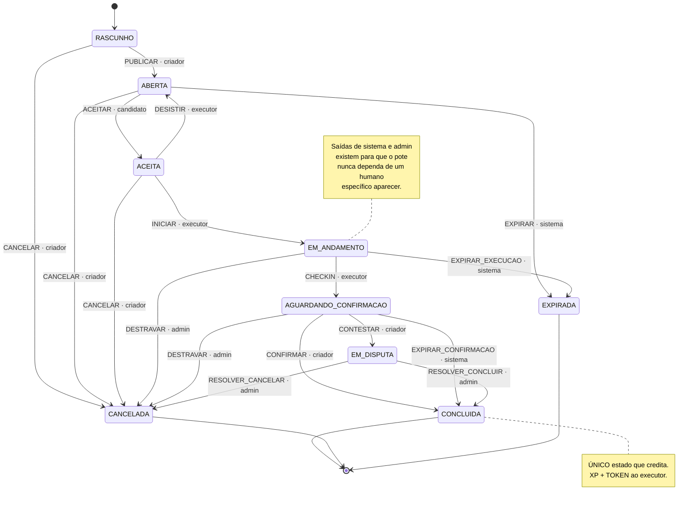

# Máquina de estados da missão

Fonte da verdade: `services/api/src/main/java/com/omnitribo/missoes/dominio/StatusMissao.java`
(bloco `static`, linhas 45–81) e `EventoMissao.java` (ator esperado de cada evento).
**9 estados, 17 transições.** Ver [ADR 0006](../adr/0006-maquina-estados-missao.md) e
[ADR 0015](../adr/0015-destravamento-de-estados-sem-saida.md).

## Os cinco atores

| Ator | Quem é | Como alcança a transição |
|---|---|---|
| `CRIADOR` | dono da missão, por identidade (não por papel) | HTTP autenticado |
| `CANDIDATO` | qualquer autenticado que **não** seja o criador | HTTP autenticado — a regra impede autonegócio no aceite |
| `EXECUTOR` | quem aceitou | HTTP autenticado |
| `ADMIN` | papel `ADMIN` | HTTP autenticado (`resolver`, `destravar`) |
| `SISTEMA` | **inalcançável por HTTP** | só o job de expiração (`ExpiracaoMissoesService`) |

## Três leituras que o desenho não entrega sozinho

**`EXPIRAR_CONFIRMACAO` leva a `CONCLUIDA`, não a `EXPIRADA` — e paga o executor.** É a única
transição de sistema que credita. A razão é de produto: houve check-in geolocalizado, e o check-in é
a evidência que o sistema aceita como prova em todo outro caminho. Punir o executor pela omissão do
criador destruiria a tese do produto.

**`CANCELAR` a partir de `RASCUNHO` existe por causa do pote.** Missão comunitária é financiada
*antes* de publicar — a publicação exige pote cobrindo a recompensa. Sem essa saída, um rascunho
financiado e abandonado prenderia os tokens dos financiadores para sempre.

**`EM_ANDAMENTO` e `AGUARDANDO_CONFIRMACAO` tinham uma saída cada, e as duas dependiam de um humano
específico.** Executor que abandonava, ou criador que sumia, imobilizava o pote **para sempre** — e
a reconciliação continuava respondendo `integro=true`, porque ledger e projeção seguiam batendo. É a
**conservação** que quebrava, não a reconciliação: invariantes diferentes, e só uma tem endpoint. A
história completa está em [`../EVOLUCAO-ARQUITETURAL.md`](../EVOLUCAO-ARQUITETURAL.md).
