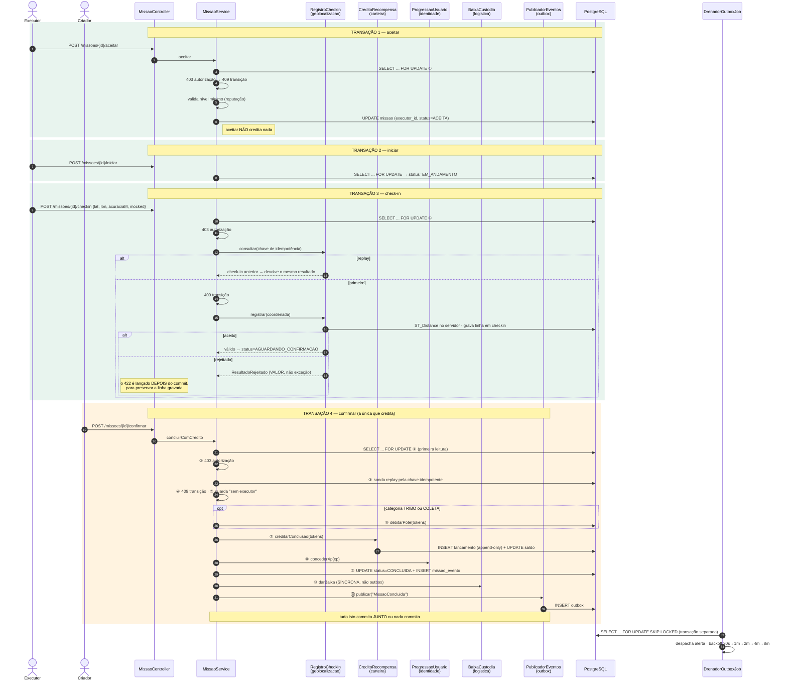

# Sequência — aceitar → iniciar → check-in → confirmar → pote pago

Fonte: `MissaoService.java` (`aplicar` linhas 941–993, `registrarCheckin` 599–693,
`concluirComCredito` 813–918) e `MissaoController.java`.

O ponto do diagrama é mostrar **o que acontece dentro de uma transação e o que fica fora dela** — é
onde estão as decisões que a banca vai perguntar.

## Por que cada decisão está onde está

**① `FOR UPDATE` é sempre a primeira leitura da transação.** Não é estilo: se outra consulta abrisse
a transação, duas conclusões concorrentes poderiam adquirir os locks em ordens diferentes e
travar uma na outra.

**A ordem 403 → 409 é obrigatória** (`MissaoStateMachine`, javadoc linhas 60–67): responder 409
antes de 403 diria a quem não tem permissão em que estado a missão está. O check-in é a única
exceção — insere a sondagem de idempotência entre os dois, para que um replay devolva o resultado
anterior em vez de um 409 enganoso.

**⑥ O débito do pote só acontece para TRIBO e COLETA.** ENTREGA e AJUDA **cunham** — é a Pendência
#1, medida em [`../evidencias/f13-conservacao-por-categoria.md`](../evidencias/f13-conservacao-por-categoria.md)
e contada por inteiro em [`../EVOLUCAO-ARQUITETURAL.md`](../EVOLUCAO-ARQUITETURAL.md).

**⑩ A baixa de custódia é SÍNCRONA, e é a única chamada de outro módulo que não passa pela outbox.**
A outbox é *at-least-once*: um redespacho liberaria uma vaga que já foi liberada, e a ocupação do
ponto viraria mentira. Liberar vaga precisa acontecer **exatamente uma vez**, então acompanha a
transação.

**⑪ A publicação na outbox é o último passo e roda na MESMA transação.** Se a conclusão der rollback,
o anúncio não sobrevive; se commitar, o anúncio está durável e o drenador o entrega com retry. É o
padrão outbox no seu propósito original — atomicidade entre mudar estado e anunciar a mudança, sem
broker.

**O `PublicadorOutbox.publicar` é `MANDATORY`, não `REQUIRED`.** Chamado fora de transação, ele
falha alto em vez de abrir uma própria — abrir uma reintroduziria exatamente a não-atomicidade que o
padrão existe para eliminar.

> **`REQUIRES_NEW` é proibido neste caminho.** A transação externa segura o `FOR UPDATE` e a interna
> pediria uma segunda conexão: com N ≥ tamanho do pool, deadlock de pool e 500 para todo mundo. Não é
> teoria — aconteceu no check-in da F6 e derrubava até o login.
