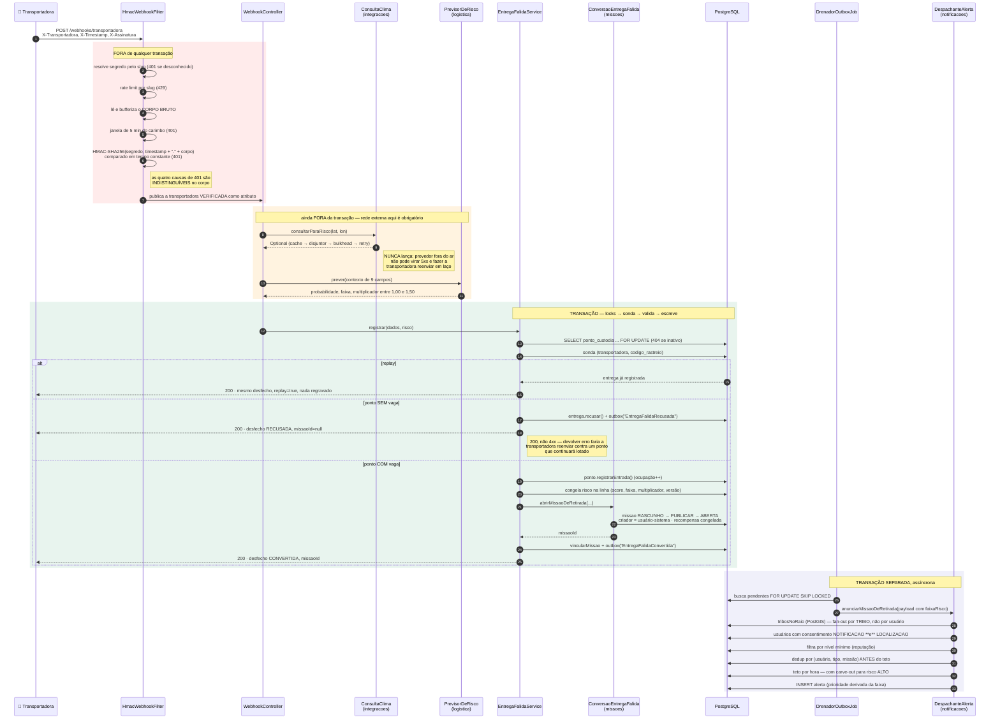

# Sequência — entrega falida → webhook → ponto de custódia → missão → notificação

A tese do produto em forma de fluxo: **uma entrega que falhou vira missão comunitária remunerada.**

Fonte: `HmacWebhookFilter.java`, `WebhookTransportadoraController.java`, `EntregaFalidaService.java`,
`DespachanteAlertaService.java`. Ver [ADR 0020](../adr/0020-ponto-de-custodia-comercial-e-proximidade-por-tribo.md)
e [ADR 0021](../adr/0021-verificacao-de-webhook-de-transportadora.md).

## Cinco decisões que o desenho torna visíveis

**O HMAC é sobre o corpo BRUTO, não sobre o objeto desserializado.** Assinar o objeto reserializado
compararia uma representação nossa, não a que a transportadora assinou — qualquer diferença de
ordem de campos ou de formatação quebraria a verificação, ou pior, a faria passar quando não devia.

**O carimbo entra DENTRO do material assinado.** Se ficasse de fora, um atacante poderia trocar o
`X-Timestamp` de uma requisição capturada e reusar a assinatura para sempre.

**O risco é calculado ANTES da transação abrir.** Se fosse calculado dentro, o `FOR UPDATE` do ponto
de custódia ficaria segurado durante uma chamada de rede externa — e um provedor lento viraria
contenção no banco.

**A recusa por lotação responde 200.** Não é erro HTTP; é desfecho de negócio, registrado e
anunciado como qualquer outro. Foi o que a execução de 2026-08-16 confirmou: a recusa gerou linha em
`entrega_falida`, evento na outbox e alerta `PONTO_CUSTODIA_LOTADO`
([evidência](../evidencias/f13-execucao-do-zero.md)).

**O fan-out é por TRIBO, não por usuário.** A tabela `usuario` não tem coluna geográfica; quem tem
posição é a tribo. Como a decisão de notificar usou a *posição* da pessoa, o consentimento exigido é
duplo: `NOTIFICACAO` **e** `LOCALIZACAO`.
