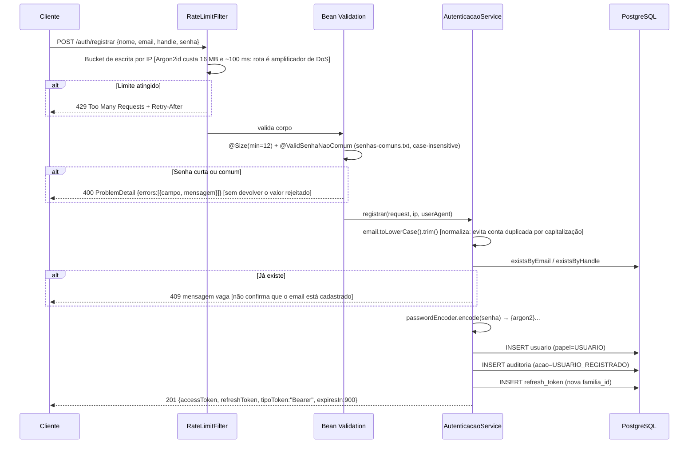
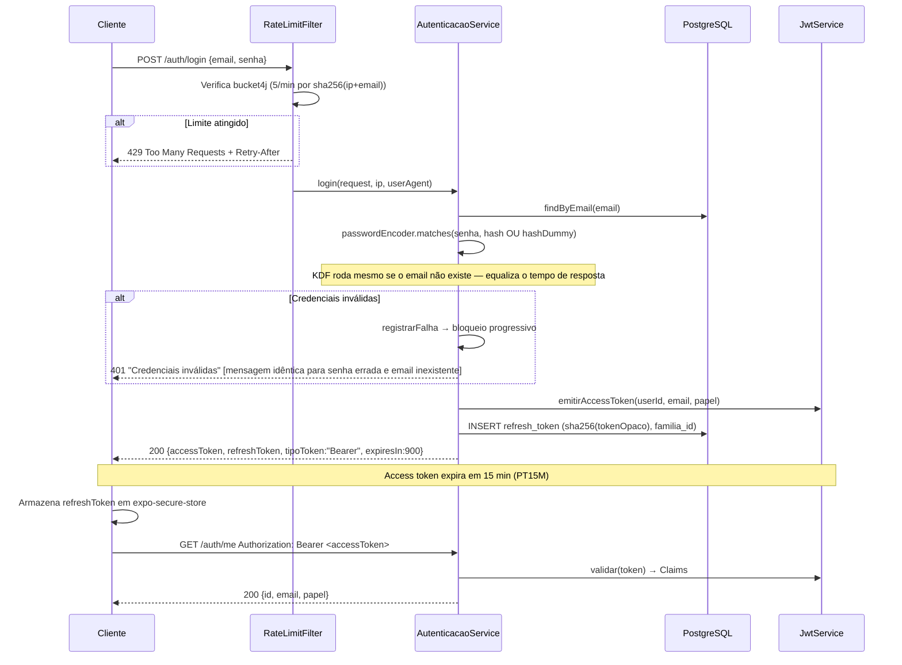
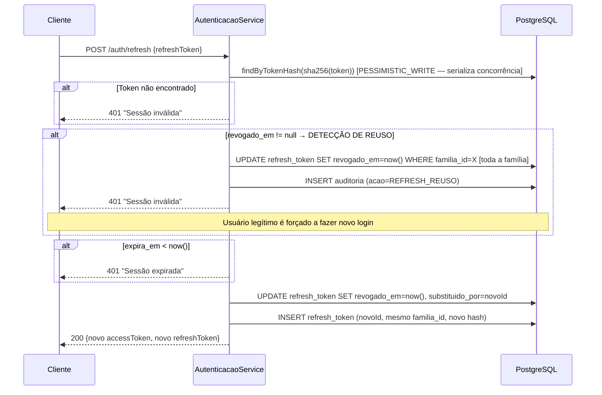

# Segurança — Autenticação

> Implementado na F2 (identidade) e revisado na F4, quando a auditoria de escrita e os testes de
> bloqueio progressivo, cabeçalhos e não-vazamento de senha foram fechados.

## Fluxos

### Registro de conta



### Login e uso de access token



### Rotação de refresh token



### Detecção de reuso — cenário de ataque

```mermaid
sequenceDiagram
    participant U as Usuário legítimo
    participant A as Atacante
    participant AS as AutenticacaoService

    Note over U,AS: T1: Login → família F1, token V1
    U->>AS: POST /auth/refresh (V1) → V2 [V1 revogado]
    A->>AS: POST /auth/refresh (V1) [V1 já revogado!]
    AS->>AS: revogado_em != null → REUSO DETECTADO
    AS->>AS: Revoga TODA a família F1 (V2 e qualquer filho)
    AS-->>A: 401 Sessão inválida
    U->>AS: POST /auth/refresh (V2) [V2 também revogado agora]
    AS-->>U: 401 Sessão inválida → novo login obrigatório
    Note over U,AS: Sessão comprometida é isolada; atacante não pode usar V2
```

## Medidas e ataques mitigados

| Medida de segurança | Ataque(s) mitigado(s) |
|---|---|
| **Argon2id** (memory-hard, 16 MB, 2 iter) | Brute-force offline de hashes vazados; ataques com GPU/ASIC |
| **RS256 assimétrico** (RSA 2048 bits) | Verificação distribuída sem expor chave privada; comprometimento de verificador não compromete emissão |
| **JWT TTL 15 min** | Janela de comprometimento de access token sem revogação no servidor |
| **Refresh com rotação** + `PESSIMISTIC_WRITE` | Roubo silencioso de refresh token; race condition na rotação concorrente |
| **Detecção de reuso** (revogação de família) | Uso de refresh token roubado após rotação legítima (RFC 6819 §5.2.2.3) |
| **Rate limiting** Bucket4j 5/min por sha256(ip+email) | Credential stuffing automatizado; enumeração de senhas por força bruta |
| **Bloqueio progressivo** 10 falhas → 15 min | Brute-force manual/lento que respeita rate limits |
| **Mensagem genérica** em login | Enumeração de usuários pelo CORPO da resposta |
| **Hash dummy** quando o email não existe | Enumeração de usuários pelo TEMPO de resposta. Sem ele o `&&` curto-circuitava e o KDF não rodava: medido **~6 ms contra ~68 ms**, 10x de diferença — a mensagem genérica sozinha não protegia nada. Coberto por `EnumeracaoUsuarioTest` |
| **JWT stateless** sem userId no corpo | IDOR (Insecure Direct Object Reference) — id vem sempre do token |
| **sha256(token)** armazenado, não o valor bruto | Comprometimento do banco não expõe tokens válidos |
| **Valor opaco 256 bits** (SecureRandom) | Previsibilidade/adivinhação de refresh token |
| **HSTS** (max-age 31536000, includeSubDomains) | Downgrade para HTTP; interceptação TLS |
| **X-Frame-Options DENY** | Clickjacking via iframe |
| **X-Content-Type-Options nosniff** | MIME sniffing pelo browser |
| **CSP** `default-src 'none'; frame-ancestors 'none'` | XSS (em API pura, contexto preventivo) |
| **CORS** lista explícita, sem wildcard | Amplificação de CSRF cross-origin em browsers |
| **CSRF desabilitado** com justificativa | Não aplicável: API stateless com Bearer header (não cookie) |
| **Validação geoespacial e de saldo no servidor** | Manipulação de valores calculados no cliente |
| **Senha mínimo 12 chars + lista senhas comuns** | Senhas fracas previsíveis; credential stuffing com top-N |
| **Rate limit em `/auth/registrar`** (bucket de escrita por IP) | DoS por amplificação: sem limite, cada requisição comprava ~100 ms de CPU e 16 MB de RAM do servidor ao custo de um POST |
| **404 em vez de 403** para rascunho de outro usuário | Enumeração de recursos — um 403 confirmaria que aquele id existe. Coberto por `MissaoControllerTest.rascunhoAlheioResponde404ENao403`; a regra está na própria consulta, então nem o total da paginação vaza rascunho alheio |
| **Mass assignment bloqueado** (DTO declara só o editável) | Escalada de privilégio por campo forjado no corpo (`status`, `executorId`, `xpRecompensa`) |
| **Auditoria append-only** (`REVOKE UPDATE, DELETE` na V2) | Adulteração da trilha por quem já comprometeu a aplicação. Ressalva honesta: o `REVOKE` incide sobre a role `omnitribo_app`; em dev e teste a conexão é do owner do banco, então a garantia só vale com o wiring de produção |
| **Escritas de missão auditadas** (`@Auditavel` + `AuditoriaAspecto`) | Ação de escrita sem rastro de quem, de onde e sob qual correlation-id — impede reconstruir um incidente |

## Configuração de referência

```yaml
app:
  jwt:
    ttl-access: PT15M           # Access token: 15 minutos
    chave-privada-caminho: ${JWT_PRIVATE_KEY_PATH:keys/private.pem}
    chave-publica-caminho: ${JWT_PUBLIC_KEY_PATH:keys/public.pem}
  rate-limit:
    login-por-minuto: 5
    falhas-para-bloqueio: 10
    janela-falhas-minutos: 15
    duracao-bloqueio-minutos: 15
```

Refresh token TTL: 30 dias (hardcoded em `AutenticacaoService.TTL_REFRESH`).

## Checklist de defesa em profundidade

Implementado e coberto por teste automatizado:

- [x] Argon2id via `DelegatingPasswordEncoder` (`SenhaConfig`), com migração `{bcrypt}` → `{argon2}` sem exigir reset de senha
- [x] JWT RS256 com chaves PEM fora do repositório (`services/api/keys/` no `.gitignore`, geradas por `tools/gerar-chaves-dev.sh` — inclusive no CI)
- [x] Claims do access token fixados em teste: `sub`, `jti`, `papel`, `iss`, `aud`, `iat`, `exp`, com TTL de 900 s
- [x] Refresh opaco de 256 bits, guardado só como `sha256`, com rotação e revogação de família no reuso — `AuthControllerTest`, `RefreshTokenFamiliaTest` (este último com 10 threads concorrentes)
- [x] Rate limit de login: 5/min por `sha256(ip+email)` → 429 com `Retry-After`
- [x] Rate limit de escrita aplicado a `/auth/registrar` — `RegistroRateLimitTest`
- [x] Bloqueio progressivo 10 falhas / 15 min → 15 min, com `LOGIN_BLOQUEADO` na auditoria — `BloqueioProgressivoTest`
- [x] HSTS, `nosniff`, `X-Frame-Options: DENY`, `Referrer-Policy`, CSP — inclusive em resposta de erro — `CabecalhosSegurancaTest`
- [x] `Authorization: Bearer` extraído apenas no servidor via `JwtAuthFilter`; identidade sempre do claim `sub`
- [x] Nenhum log com senha, token ou refresh — `AuthControllerTest.senhaEToken_nuncaAparecemEmLog`
- [x] Senha nunca volta no corpo da resposta, nem ecoada em erro de validação
- [x] Flyway como única fonte de schema; `ddl-auto: validate`
- [x] Erros retornam RFC 9457 ProblemDetail sem stack trace, SQL ou nome de classe
- [x] `auditoria` append-only (`REVOKE UPDATE, DELETE` na V2) — ver ressalva na tabela acima
- [x] 404 em vez de 403 para rascunho de outro usuário (anti-enumeração de recurso)
- [x] Escritas de missão auditadas por AOP com ator, IP, user-agent e correlation-id — `AuditoriaMissaoTest`

Pendente, por fase:

- [ ] Credencial em `expo-secure-store` no mobile (nunca `AsyncStorage`) — F9 (o app ainda não existe: `apps/mobile/` só tem documentação)
- [ ] Deep links validados (esquema + host + formato) antes de navegar — F9
- [x] Webhooks verificados por HMAC sobre corpo bruto em tempo constante — `HmacWebhookFilter`, ADR 0021, testado em `WebhookEntregaFalidaTest`

  A advertência que estava aqui — "`/api/v1/webhooks/**` já está em `permitAll()` e ainda não tem
  controller; um controller criado nesse prefixo antes do HMAC nasce público" — foi levada a sério
  duas vezes. Primeiro o matcher foi REMOVIDO do `permitAll`, fechando a rota enquanto a proteção
  não existisse. Agora ele voltou, **na mesma mudança** que trouxe o filtro. `permitAll` aqui
  significa "a autenticação desta rota não é o JWT", e não "rota aberta": quem autentica é o HMAC
  sobre o corpo bruto, e ele recusa com 401 antes de qualquer controller. Remover o filtro sem
  remover a linha reabre o buraco.
- [ ] Transferências entre carteiras com lock em ordem determinística — F5
- [ ] Auditar tentativas de escrita negadas (`@AfterThrowing`) — F12
- [ ] Rate limit e bloqueio distribuídos (hoje `ConcurrentHashMap` em memória, single-instance) — F12

## Limites conhecidos da suíte de testes

O bloqueio progressivo **não** é exercitado por 10 requisições HTTP de login. O bucket de 5/min é
consumido dentro de `BloqueioLoginService.verificar()`, e a partir da 6ª tentativa o
`AutenticacaoService` lança `BloqueioException` **antes** de chamar `registrarFalha()` — ou seja, por
HTTP só se acumulam 5 falhas por minuto, e chegar a 10 exigiria mais de dois minutos de espera real
dentro do teste.

`BloqueioProgressivoTest` semeia o contador chamando `registrarFalha()`, que é o mesmo método
invocado no caminho de senha errada, e então verifica o efeito nas três pontas: o serviço recusa com
`Retry-After` de ~900 s (contra os 60 s do bucket — é essa diferença que prova ser bloqueio e não
rate limit), o endpoint real de login devolve 429, e a linha `LOGIN_BLOQUEADO` chega à tabela
`auditoria`.

O estado de bloqueio vive em memória e não sobrevive a restart do processo. É consequência aceita do
MVP single-instance (ver ADR 0005); a migração para contador distribuído está em F12.
